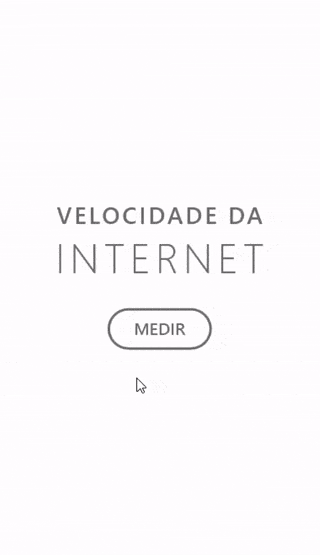
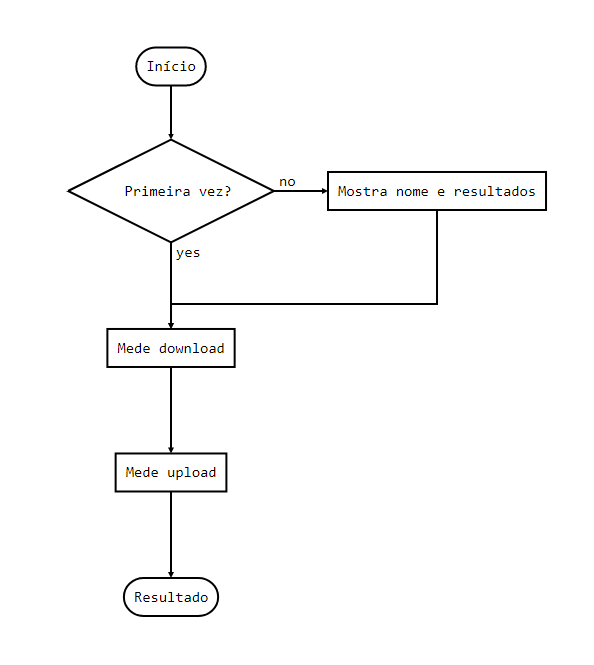

# Medidor de velocidade da Internet
Este é um protótipo de UI (user interface / frontend) de um aplicativo que simula a medição da velocidade de download e upload de uma conexão com a Internet.
Um single page application (SPA) desenvolvido em HTML, CSS, e JavaScript com arquitetura MVC (Model-View-Controller).
Otimizado e servido com Webpack.

Para iniciar o servidor em [localhost:8080](http://localhost:8080/) utilize: `$ npm start`

Acesse o aplicativo em [https://danimai.github.io/speedtest-app/dist/](https://danimai.github.io/speedtest-app/dist/)

Estrutura de arquivos:
 
`docs/` mockup original em Adobe XD e GIF animado apresentando a interface gráfica

`src/` arquivos fonte do app

`dist/` arquivos gerados e otimizados para distribuição em produção

## Interface

## Fluxograma

